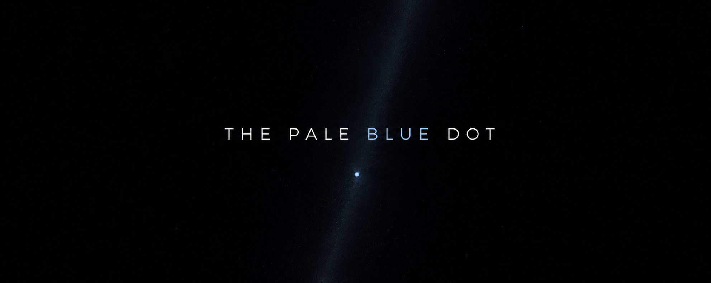

<p align="center">
  
</p>

<h1 align="center">The Pale Blue Dot</h1>

<p align="justify">
In 1990, a spacecraft leaving the solar system turned around and took a
picture of home. From six billion kilometers away, Earth was a speck — a
pale point of light, easy to miss.
<br><br>
That photograph is why this repo is named what it is.
<br><br>
This is my personal site. A take on that image.
If a whole planet can fit in a pixel, a site can afford to be small — and
still be worth entering.
<br><br>
The Pale Blue Dot holds the work I make, and the stories behind it.
Not a resume. Not a grid of thumbnails.
A small place, built to be arrived at. Proof that the point of light is
tiny, and that what we do on it still matters.
</p>

## Stack

- [Next.js 16](https://nextjs.org) (App Router) + React 19 + TypeScript
- [Tailwind CSS v4](https://tailwindcss.com) with the Horizon design system mapped
  into the theme (`src/styles/horizon/`)
- [Prettier](https://prettier.io) (with `prettier-plugin-tailwindcss`) for
  formatting

## Getting started

```bash
npm install
npm run dev
```

Open [http://localhost:3000](http://localhost:3000).

## Scripts

- `npm run dev` — start the dev server
- `npm run build` — production build
- `npm run start` — serve the production build
- `npm run lint` — ESLint
- `npm run typecheck` — Next typegen, then TypeScript, no emit
- `npm run format` — Prettier, write
- `npm run format:check` — Prettier, check only
- `npm run ci` — format, lint, typecheck, then build
